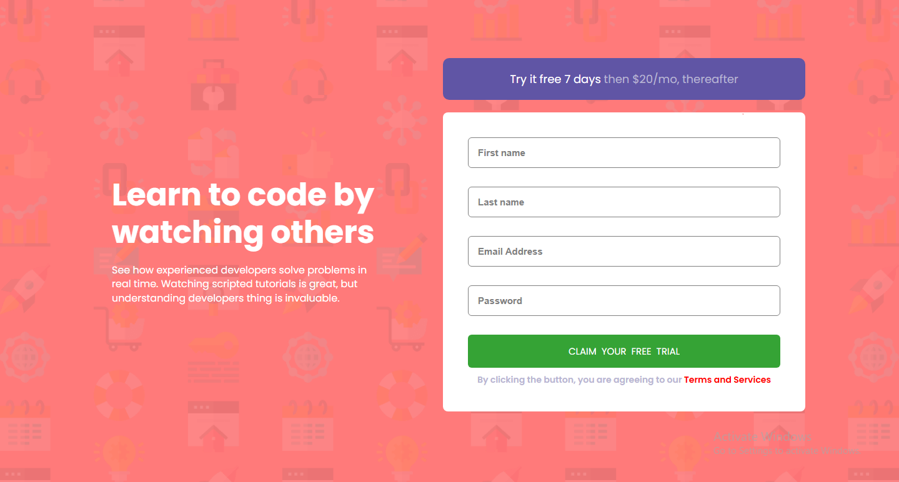

# Frontend Mentor - Intro component with sign up form solution

This is a solution to the [Intro component with sign up form challenge on Frontend Mentor](https://www.frontendmentor.io/challenges/intro-component-with-signup-form-5cf91bd49edda32581d28fd1). Frontend Mentor challenges help you improve your coding skills by building realistic projects. 

## Table of contents

- [Overview](#overview)
  - [The challenge](#the-challenge)
  - [Screenshot](#screenshot)
  - [Links](#links)
- [My process](#my-process)
  - [Built with](#built-with)
  - [What I learned](#what-i-learned)
  - [Continued development](#continued-development)
  - [Useful resources](#useful-resources)
- [Author](#author)
- [Acknowledgments](#acknowledgments)


## Overview

### The challenge

Users should be able to:

- View the optimal layout for the site depending on their device's screen size
- See hover states for all interactive elements on the page
- Receive an error message when the `form` is submitted if:
  - Any `input` field is empty. The message for this error should say *"[Field Name] cannot be empty"*
  - The email address is not formatted correctly (i.e. a correct email address should have this structure: `name@host.tld`). The message for this error should say *"Looks like this is not an email"*

### Screenshot




### Links

- Live Site URL: [Add live site URL here](https://your-live-site-url.com)

## My process

### Built with

- Semantic HTML5 markup
- CSS custom properties
- Flexbox
- CSS Grid
- Mobile-first workflow
- JavaScript


### What I learned
I learnt how to trigger a submit button and also how to make an error message when the wrong field is being inputed and also to make them disappear when the right field is in place.

To see how you can add code snippets, see below:


```css
.submit{
    display: flex;
    justify-content: center;
    align-items: center;
}


::placeholder{
    color: grey;
    font-size: 15px;
    font-weight: 600;
}

.sub-btn{
    padding: 15px;
    width: 500px;
    border: none;
    color: white;
    background-color: rgb(53, 163, 53);
    text-transform: uppercase;
    font-family: "poppins", sans-serif;
    font-size: 15px;
    word-spacing: 4px;
    border-radius: 6px;
}

.sub-btn:hover{
    background-color: hsl(154, 59%, 51%);
    cursor: pointer;
}
```
```js
/* TO TRIGGER THE SUBMIT BUTTON */
submitBtn.addEventListener("click", (e) => {
    e.preventDefault();

    /* FIRST INPUT */
    if(firstName.value.trim() === ""){
       errorFirstName.style.display = "flex";
       firstName.style.border = "1px solid red";
       firstName.classList.remove("active");
    } else {
        errorFirstName.style.display = "none";
        firstName.classList.add("active");
        firstName.style.border = "1px solid grey";
    }

    /* SECOND INPUT */
    if(lastName.value.trim() === ""){
       errorLastName.style.display = "flex";
       lastName.style.border = "1px solid red";
       lastName.classList.remove("active");
    } else {
        errorLastName.style.display = "none";
        lastName.classList.add("active");
        lastName.style.border = "1px solid grey";
    }

    /* THIRD INPUT */
    if(email.value.trim() === "" || !isEmailValid(email.value)){
       errorEmail.style.display = "flex";
       email.style.border = "1px solid red";
       email.classList.remove("active");
    } else {
        errorEmail.style.display = "none";
        email.classList.add("active");
        email.style.border = "1px solid grey";
    }

    /* FOURTH INPUT */
    if(password.value.trim() === ""){
       errorPassword.style.display = "flex";
       password.style.border = "1px solid red";
       password.classList.remove("active");
    } else {
        errorPassword.style.display = "none";
        password.classList.add("active");
        password.style.border = "1px solid grey";
    }

    if (
        firstName.value.trim() !== "" &&
        lastName.value.trim() !== "" &&
        isEmailValid(email.value) &&
        password.value.trim() !== ""
    ) {
        location.reload(); // Reload the page
    }
});
```

If you want more help with writing markdown, we'd recommend checking out [The Markdown Guide](https://www.markdownguide.org/) to learn more.

**Note: Delete this note and the content within this section and replace with your own learnings.**


### Continued development

I will learn how to use event listeners very well and how to apply error messages to my code..


## Author
- Frontend Mentor - [@Wizdev0](https://www.frontendmentor.io/profile/Wizdev0)
- Twitter - [@otutech](https://www.twitter.com/otutech)
